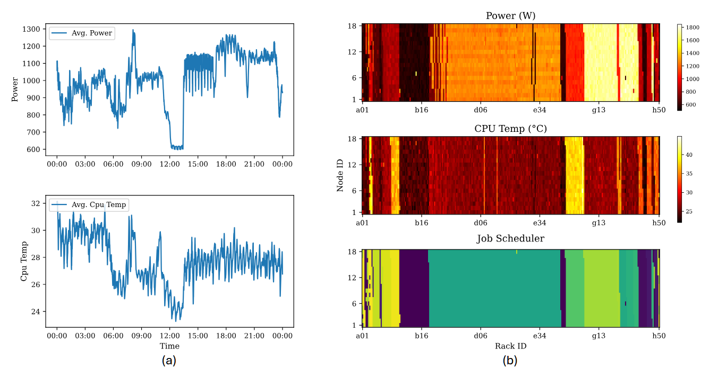

# Clusterwise: HPC Timeseries Dataset

[Licenced by CC-BY 4.0](https://creativecommons.org/licenses/by/4.0/)

# Introduction

High performance computing (HPC) systems are foundational to modern scientific discovery, engineering advancements, and the development of artificial intelligence. These complex systems, often comprising thousands of interconnected compute nodes, generate vast quantities of operational data, including logs, performance metrics, and system telemetry. As the scale and intricacy of HPC environments continue to grow, there's a pressing need to apply machine learning (ML) techniques to enhance their reliability, efficiency, and overall operational insight. Researchers are actively exploring ML applications for tasks such as predicting system failures, forecasting resource utilization, and optimizing job scheduling. However, a significant impediment to progress in this domain is the scarcity of large-scale, publicly available, and multimodal benchmark datasets derived from real-world production HPC systems. To bridge this critical gap, we introduce ClusterWise, a comprehensive, multimodal benchmark. This benchmark is meticulously constructed by curating and aligning over 500 GB of operational data collected from two distinct, heterogeneous HPC clusters. ClusterWise integrates job scheduler logs, system error logs, and a rich variety of telemetry data, including temperature, power consumption.

# Dataset

The data is publicly available on [Huggingface](https://huggingface.co/datasets/MachaParfait/ClusterWise).

## Generating Dataset from scratch

| Dataset Name | # of telemetry | # of hosts | size (GB) | data source                                       | data collect frequency        | Download |
| ------------ | -------------- | ---------- | --------- | ------------------------------------------------- | ----------------------------- | -------- |
| OLCF         | 28             | 4626       | 492       | GPULog, OpenBMC, Job scheduler allocation history | at occurrence; 10 sec per job | [1,2]    |

[1] [Long Term Per-Component Power and Thermal Measurements of the OLCF Summit System](https://doi.ccs.ornl.gov/dataset/086578e9-8a9f-56b1-a657-0ed8b7393deb)

[2] [OLCF Summit Supercomputer GPU Snapshots During Double-Bit Errors and Normal Operations](https://doi.ccs.ornl.gov/dataset/56c244d2-d273-5222-8f4b-f2324282fab8)

- Step 1: Download the Dataset using Globus

```bash
mkdir -p /rawdata
```

Please refer to `docs/globus.md` for detailed instructions on downloading the raw dataset to `/rawdata`.

- Step 2: Generate the Dataset

```bash
conda env create -f environment.yml
conda activate hpctime
mkdir -p /data
./src/generate_olcf.py
./src/generate_olcf_mini.py
```

You would get the following files in `/data`:

```bash
data/
├── olcf/
│   ├── 202001/
│   │   └── *.parquet
│   ├── 202008/
│   │   └── *.parquet
│   ├── 202102/
│   │   └── *.parquet
│   ├── 202108/
│   │   └── *.parquet
│   ├── 202201/
│   │   └── *.parquet
│   └── features.txt
├── olcf_mini/
│   ├── 202001/
│   │   └── *.parquet
│   ├── 202008/
│   │   └── *.parquet
│   ├── 202102/
│   │   └── *.parquet
│   ├── 202108/
│   │   └── *.parquet
│   ├── 202201/
│   │   └── *.parquet
│   └── features.txt
└── failures.txt
```

The `olcf` directory contains the full dataset, while `olcf_mini` offers a smaller subset created by aggregating telemetry data for each CPU core. The `features.txt` file lists the features included in the dataset, and `failures.txt` details GPU failures.

The `olcf_mini` dataset (221 GB) is hosted on [Hugging Face](https://huggingface.co/datasets/MachaParfait/ClusterWise).

## Data Fields

| Field           | Type          | Description                                                                                     |
| :-------------- | :------------ | :---------------------------------------------------------------------------------------------- |
| timestamp       | timestamp[ms] | Timestamp of the record                                                                         |
| node_state      | string        | State of the node                                                                               |
| hostname        | string        | Hostname of the node, indicating its physical location. Format: `<cabinet_column:[a-h]><cabinet_row:[0-24]>n<node_in_rack:[1-18]>`. Node position in rack is from bottom (1) to top (18). |
| job_begin_time  | timestamp[ms] | Timestamp of when the job started                                                               |
| job_end_time    | timestamp[ms] | Timestamp of when the job terminated                                                            |
| allocation_id   | int64         | Unique identifier of the job                                                                    |
| label           | float64       | Indicates if the record corresponds to a failure event (e.g., 1 for failure, 0 for normal)    |
| xid             | float64       | Nvidia error code representing failure type                                                     |
| gpu0_core_temp  | float         | Core temperature of the 1st Nvidia V100 GPU attached to the first Power9 CPU (Celsius)          |
| gpu0_mem_temp   | float         | Memory (HBM) temperature of the 1st Nvidia V100 GPU attached to the first Power9 CPU (Celsius)  |
| gpu1_core_temp  | float         | Core temperature of the 2nd Nvidia V100 GPU attached to the first Power9 CPU (Celsius)          |
| gpu1_mem_temp   | float         | Memory (HBM) temperature of the 2nd Nvidia V100 GPU attached to the first Power9 CPU (Celsius)  |
| gpu2_core_temp  | float         | Core temperature of the 3rd Nvidia V100 GPU attached to the first Power9 CPU (Celsius)          |
| gpu2_mem_temp   | float         | Memory (HBM) temperature of the 3rd Nvidia V100 GPU attached to the first Power9 CPU (Celsius)  |
| gpu3_core_temp  | float         | Core temperature of the 1st Nvidia V100 GPU attached to the second Power9 CPU (Celsius)         |
| gpu3_mem_temp   | float         | Memory (HBM) temperature of the 1st Nvidia V100 GPU attached to the second Power9 CPU (Celsius) |
| gpu4_core_temp  | float         | Core temperature of the 2nd Nvidia V100 GPU attached to the second Power9 CPU (Celsius)         |
| gpu4_mem_temp   | float         | Memory (HBM) temperature of the 2nd Nvidia V100 GPU attached to the second Power9 CPU (Celsius) |
| gpu5_core_temp  | float         | Core temperature of the 3rd Nvidia V100 GPU attached to the second Power9 CPU (Celsius)         |
| gpu5_mem_temp   | float         | Memory (HBM) temperature of the 3rd Nvidia V100 GPU attached to the second Power9 CPU (Celsius) |
| p0_gpu0_power   | float         | DC power consumption of the 1st Nvidia V100 GPU attached to the first Power9 CPU (Watts)        |
| p0_gpu1_power   | float         | DC power consumption of the 2nd Nvidia V100 GPU attached to the first Power9 CPU (Watts)        |
| p0_gpu2_power   | float         | DC power consumption of the 3rd Nvidia V100 GPU attached to the first Power9 CPU (Watts)        |
| p0_power        | float         | DC power consumption of the first Power9 CPU in the node (Watts)                                |
| p0_temp_max     | float         | Maximum core temperature of the first Power9 CPU (Celsius)                                      |
| p0_temp_mean    | float         | Mean core temperature of the first Power9 CPU (Celsius)                                         |
| p0_temp_min     | float         | Minimum core temperature of the first Power9 CPU (Celsius)                                      |
| p1_gpu0_power   | float         | DC power consumption of the 1st Nvidia V100 GPU attached to the second Power9 CPU (Watts)       |
| p1_gpu1_power   | float         | DC power consumption of the 2nd Nvidia V100 GPU attached to the second Power9 CPU (Watts)       |
| p1_gpu2_power   | float         | DC power consumption of the 3rd Nvidia V100 GPU attached to the second Power9 CPU (Watts)       |
| p1_power        | float         | DC power consumption of the second Power9 CPU in the node (Watts)                               |
| p1_temp_max     | float         | Maximum core temperature of the second Power9 CPU (Celsius)                                     |
| p1_temp_mean    | float         | Mean core temperature of the second Power9 CPU (Celsius)                                        |
| p1_temp_min     | float         | Minimum core temperature of the second Power9 CPU (Celsius)                                     |
| ps0_input_power | float         | AC input power consumption of the first node power supply (Watts)                               |
| ps1_input_power | float         | AC input power consumption of the second node power supply (Watts)                              |

## Snippet

<!--  -->
<div align="center">
  
</div>


We provide an example views from ClusterWise dataset: (a) Cluster-level average power and CPU temperature over 24 hours. (b) Node-level power, temperature, and job allocation at a single time snapshot.

# Benchmark

We provide a comprehensive benchmark suite to facilitate the evaluation and development of advanced deep time series models for HPC operational data. This suite supports key tasks such as long-term forecasting and anomaly detection, and uniquely enables the integration of multimodal data sources, including job scheduler logs and physical layout information. By offering a robust platform for testing models against complex, real-world HPC scenarios, this benchmark aims to accelerate research into improving system reliability, operational efficiency, and predictive maintenance in high-performance computing environments.

## Usage
- Prepare the data: Download the ClusterWise mini dataset (1.31 GB) from [Hugging Face](https://huggingface.co/datasets/MachaParfait/ClusterWise_mini) and extract it into the `data/` directory.

```bash
data/
├── olcf_task/
└── failures.txt
```
- Prepare the environment:

```bash
conda env create -f environment2.yml
conda activate hpctask
```

- Train and evaluate models: We provide experiment scripts for all benchmarks in the `./scripts/` directory. You can reproduce our experimental results by running the following commands:
```
# Cluster-level Power Consumption Forecasting
bash ./scripts/long_term_forecast/run_all_olcf_cluster_eval.sh
# Node-level Telemetry Forecasting
bash ./scripts/long_term_forecast/run_all_olcf_eval.sh
# Scaling Model with Multi-node Data
bash ./scripts/long_term_forecast/run_all_olcf_mmd_eval.sh
# anomaly detection
bash ./scripts/anomaly_detection/run_all_olcf_anomaly_detection.sh
```

